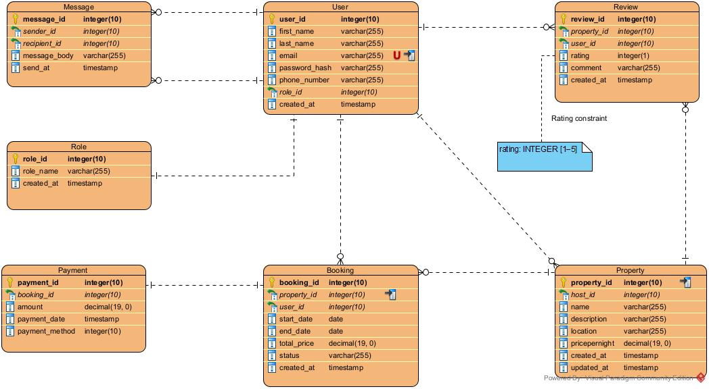

# 🗂️ ER Diagram – Airbnb Database Design

## 📌 Objective

This document outlines the **Entity-Relationship Diagram (ERD)** for an Airbnb-like relational database system. The ERD visually represents all key entities, their attributes, and the relationships between them, based on the specification provided in the ALX Airbnb Database Module.

---

## 🧱 Entities and Attributes

### 1. **User**
- `user_id` (PK, UUID)
- `first_name` (VARCHAR, NOT NULL)
- `last_name` (VARCHAR, NOT NULL)
- `email` (VARCHAR, UNIQUE, NOT NULL, INDEXED)
- `password_hash` (VARCHAR, NOT NULL)
- `phone_number` (VARCHAR, NULLABLE)
- `role_id` (FK → Role.role_id)
- `created_at` (TIMESTAMP, DEFAULT CURRENT_TIMESTAMP)

### 2. **Role**
- `role_id` (PK, UUID or INTEGER)
- `role_name` (VARCHAR, UNIQUE) — e.g., guest, host, admin
- `created_at` (TIMESTAMP)

### 3. **Property**
- `property_id` (PK, UUID)
- `host_id` (FK → User.user_id)
- `name` (VARCHAR, NOT NULL)
- `description` (TEXT, NOT NULL)
- `location` (VARCHAR, NOT NULL)
- `price_per_night` (DECIMAL, NOT NULL)
- `created_at` (TIMESTAMP, DEFAULT CURRENT_TIMESTAMP)
- `updated_at` (TIMESTAMP, ON UPDATE CURRENT_TIMESTAMP)

### 4. **Booking**
- `booking_id` (PK, UUID)
- `property_id` (FK → Property.property_id)
- `user_id` (FK → User.user_id)
- `start_date`, `end_date` (DATE, NOT NULL)
- `total_price` (DECIMAL, NOT NULL)
- `status` (e.g., pending, confirmed, canceled) — stored as FK or ENUM
- `created_at` (TIMESTAMP, DEFAULT CURRENT_TIMESTAMP)

### 5. **Payment**
- `payment_id` (PK, UUID)
- `booking_id` (FK → Booking.booking_id)
- `amount` (DECIMAL, NOT NULL)
- `payment_date` (TIMESTAMP)
- `payment_method` (e.g., credit_card, stripe, paypal) — optionally modeled as FK

### 6. **Review**
- `review_id` (PK, UUID)
- `property_id` (FK → Property.property_id)
- `user_id` (FK → User.user_id)
- `rating` (INTEGER, CHECK BETWEEN 1–5)
- `comment` (TEXT, NOT NULL)
- `created_at` (TIMESTAMP)

### 7. **Message**
- `message_id` (PK, UUID)
- `sender_id` (FK → User.user_id)
- `recipient_id` (FK → User.user_id)
- `message_body` (TEXT, NOT NULL)
- `send_at` (TIMESTAMP, DEFAULT CURRENT_TIMESTAMP)

---

## 🔗 Relationships Summary

| From Entity | To Entity | Relationship Type | Description |
|-------------|-----------|-------------------|-------------|
| User        | Role      | Many-to-One       | A user has one role |
| User        | Property  | One-to-Many       | A host can list multiple properties |
| User        | Booking   | One-to-Many       | A user (guest) can make many bookings |
| Property    | Booking   | One-to-Many       | A property can be booked many times |
| Booking     | Payment   | One-to-One        | Each booking has one payment |
| Property    | Review    | One-to-Many       | A property can have many reviews |
| User        | Review    | One-to-Many       | A user can write many reviews |
| User        | Message   | One-to-Many (x2)  | Users can send and receive messages |

---

## 🧩 Diagram Image

Below is the ER diagram exported from Visual Paradigm:

